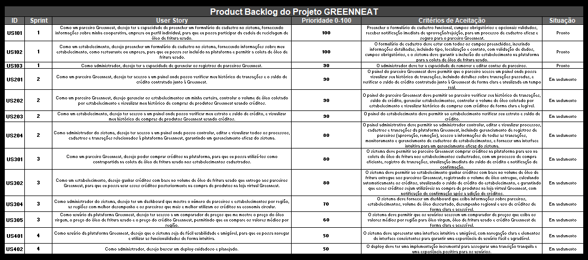
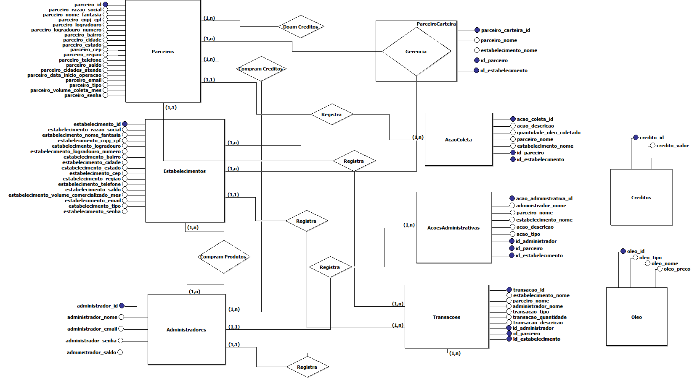
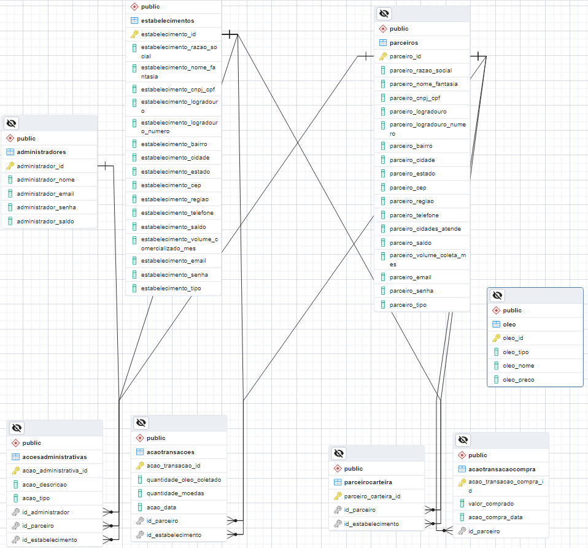
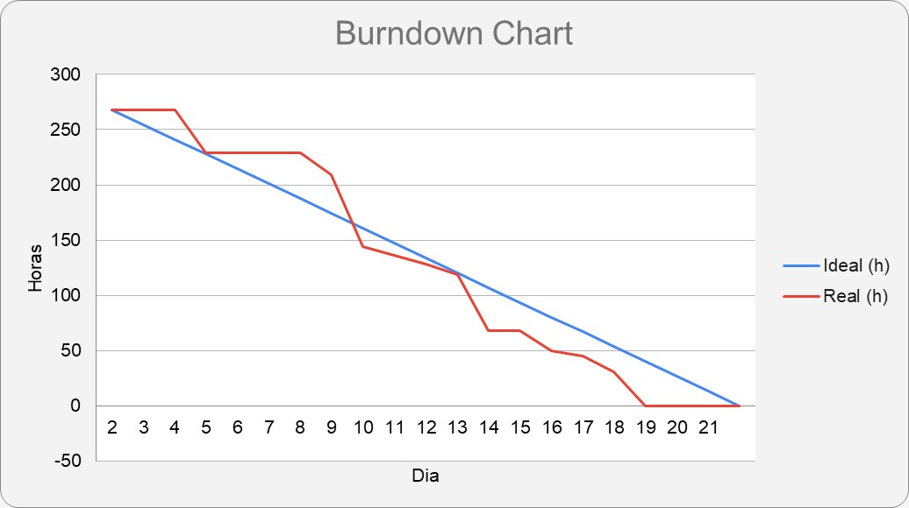
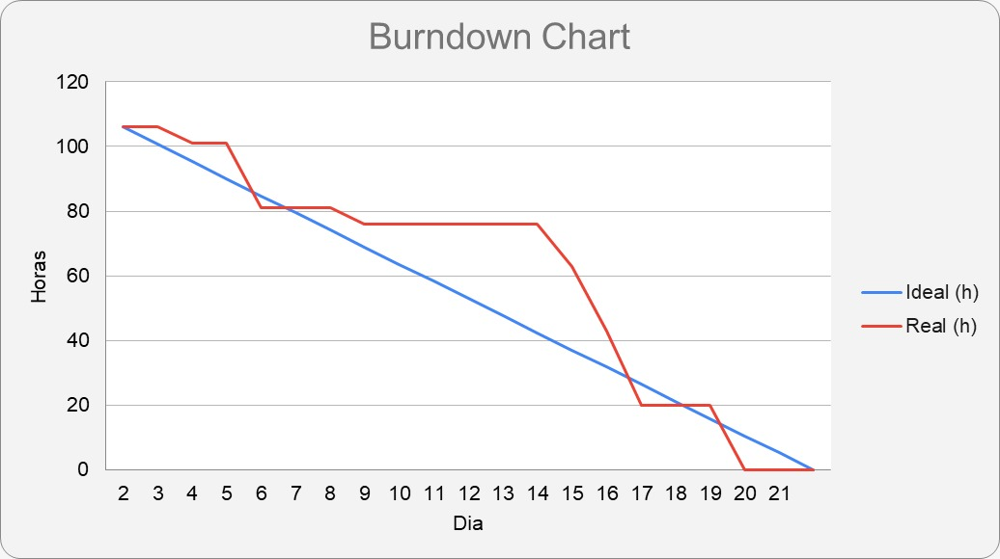

# API--4-ADS - Quantum Team

 

<h1> Aprendizado por Projeto Integrado do 4º semestre da Faculdade de Tecnologia de São José dos Campos - "Professor Jessen Vidal". </h1>

   

<h2> O Projeto 💼 </h2>

 O projeto Sistema circular de produção de saneantes a partir de óleo recuperado, tem o objetivo de envolver os agentes participantes da cadeia de descarte e reciclagem do óleo de fritura usado. O desafio consiste em criar uma plataforma que gerencie os créditos a serem usados como contrapartida no momento da coleta do material pelo parceiro da Greenneat nos estabelecimentos cadastrados. De forma que os créditos poderão ser usados posteriormente para compra dos saneantes na loja virtual.

 

<h2>Objetivo do Projeto 📌</h2>

 Desenvolver um sistema web de gerenciamento de créditos e controle de descarte e coleta de óleo usado pela empresa Greenneat atráves de Parceiros coletores e Estabelecimentos fornecedores, além de um sistema de créditos para eventualmente ser usado para transações em uma loja virtual.  

 
  
 
<h3> Requisitos Funcionais: </h3>

 ◠Desenvolver formulário de cadastro do parceiro Greenneat; 

 ◠Desenvolver formulário de cadastro dos estabelecimentos onde o óleo será coletado;  

 ◠Sistema de transação de créditos Greenneat; 

 ◠Painel do usuário parceiro; 

 ● Painel do estabelecimento; 

 ● Painel administrativo; 

 ● Desenvolver um dashboard de rankings; 

 ◠Desenvolver um comparador de preços entre o óleo virgem, óleo usado e créditos Greenneat. 

  

<h3> Requisitos Não Funcionais: </h3> 

 
 ◠Bom tempo de resposta e execução nas transações; 

 
 ◠Boa usabilidade e amigável; 

 
 ◠O sistema deve conter métricas que ajudem a observar o seu comportamento. 

  
  
 
<h2>Cronograma das Sprints 📆</h2>
 
 

<h3> ● Sprint 1 - 04/09 a 24/09 </h3>

✔️ Wireframe;  
✔️ Modelagem e Criação do Banco de Dados;  
✔️ Formulários de Cadastro;  
✔️ Autenticação e Autorização;  
✔️ Sistema de Rotas;  
✔️ Ínicio dos Painéis.  

<h3> ● Sprint 2 - 25/09 a 15/10 </h3>

✔️ Painel Administrativo;   
✔️ Painel do Parceiro Greenneat;  
✔️ Painel do Estabelecimento;  
✔️ Sistema de Créditos Greenneat;  
✔️ Transações.  

<h3> ● Sprint 3 - 16/10 a 05/11 </h3>

✔️ Dashboard de Rankings;  
✔️ Comparador de Preços.  

<h3> ● Sprint 4 - 06/11 a 26/11 </h3>
✔️ Otimizações e Correções de Bugs;  
✔️ Melhorias na Usabilidade do Sistema;  
✔️ Deploy e Release.  

 
 
<h2>Demonstração completa de nosso sistema 💻</h2> 
<h3> Video Sprint Review 1:</h3>

<h3> Link no YouTube da aplicação: https://youtu.be/rwHQRRK0gV4</h3>
 
 
<h3> Video Sprint Review 2:</h3>

 
 

<h2>Tecnologias Utilizadas 🔧</h2>
 
● Front-end: React; 
● Back-end: Node.js; 
◠Linguagem de Programação: TypeScript; 
● Banco de Dados: PostgreSQL; 
● Ferramentas: Git, GitHub, Visual Studio Code, Figma, Canva. 

               

 
 

<h2>Backlog 📊</h2> 
 O product backlog é uma lista ordenada que tem como função documentar de forma clara todos os requisitos do desenvolvimento de um projeto. Itens que precisem de maior refinamento geralmente têm uma importância menor e ficam mais abaixo no Product Backlog.  
 

 
 
 
<h2>Modelo de dados📑</h2> 
 Um modelo de banco de dados mostra a estrutura lógica de um banco de dados, incluindo as relações e restrições que determinam como os dados podem ser armazenados e acessados.
 

<h5>Modelo Conceitual<h5>

 

<h5>Modelo Lógico<h5>

 

<h2>Burndown 📈📉 </h2>  
 O Sprint Burndown Chart mostra a comparação entre o trabalho estimado inicialmente no Sprint Planning Meeting com a quantidade restante estimada de trabalho.
 
<h3>Burndown - 1ª Sprint </h3>  

 
<h3>Burndown - 2ª Sprint </h3>  

 

<h2>Equipe 👾</h2>
 
 Nome|Função|Github|Linkedin 
-----|------|------|---------
Rafaela Cabral      |Scrum Master |[@Github](https://github.com/RafaelaCabral)|[@Linkedin](https://www.linkedin.com/in/rafaela-vieira-cabral-733b5922a)
Eliézer Lopes       |Product Owner|[@Github](https://github.com/EliezerLopes1)|[@Linkedin](https://www.linkedin.com/in/eli%C3%A9zer-lopes-b89a4124a)
Nicolas Pereira     |Desenvolvedor|[@Github](https://github.com/NicolasPereira06)|[@Linkedin](https://www.linkedin.com/in/nicolaspereira06/)
Thalles Torres      |Desenvolvedor|[@Github](https://github.com/thallestorres)|[@Linkedin](www.linkedin.com/in/thalles-torres-83449a285)
Nicholas Teodoro    |Desenvolvedor|[@Github](https://github.com/nicholasgui29)|[@Linkedin](https://www.linkedin.com/in/nicholas-guilherme-bb926a248/)
Roberto Barros      |Desenvolvedor|[@Github](https://github.com/robertobarros5)|[@Linkedin](https://www.linkedin.com/in/robertodebarros)
Francisco Quirino   |Desenvolvedor|[@Github](https://www.github.com/ciscoquirino)|[@Linkedin](https://www.linkedin.com/in/francisco-quirino )
 
 
